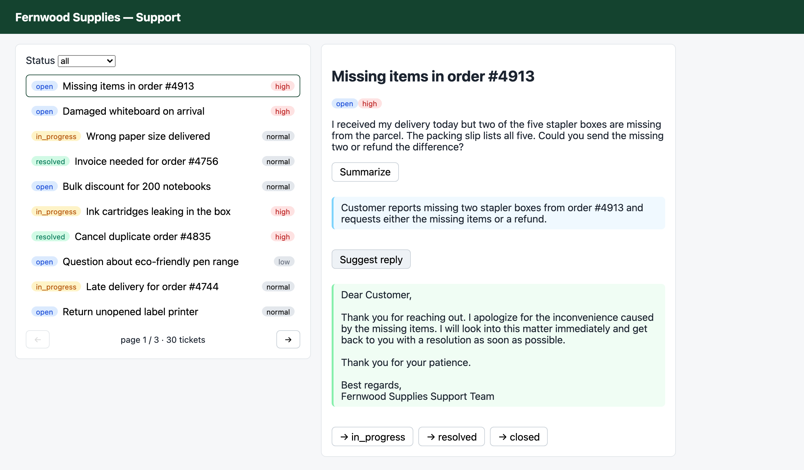
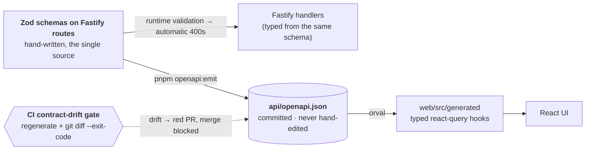
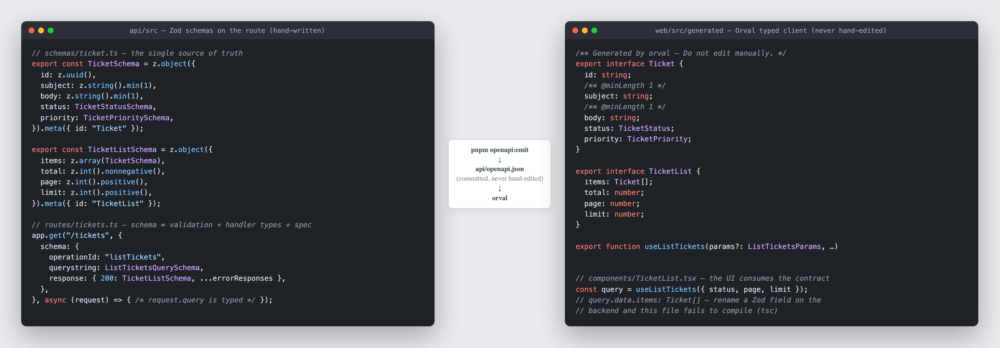
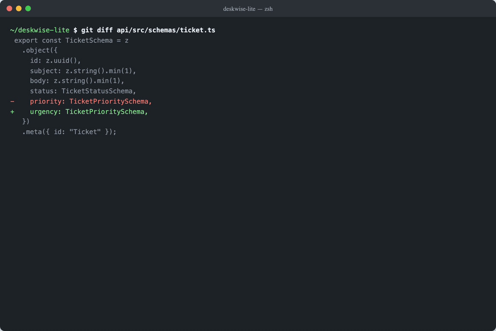
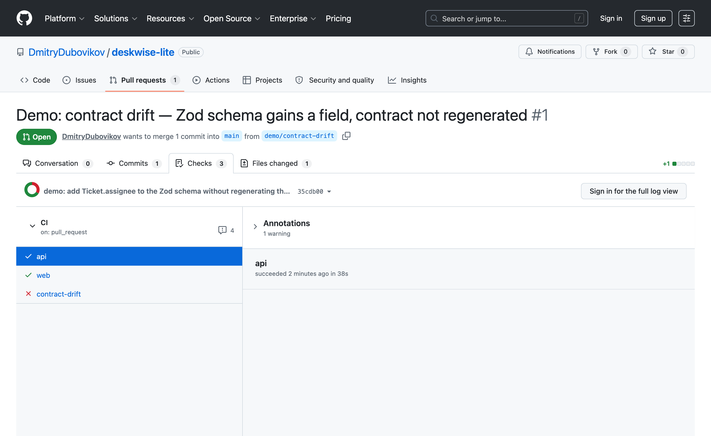
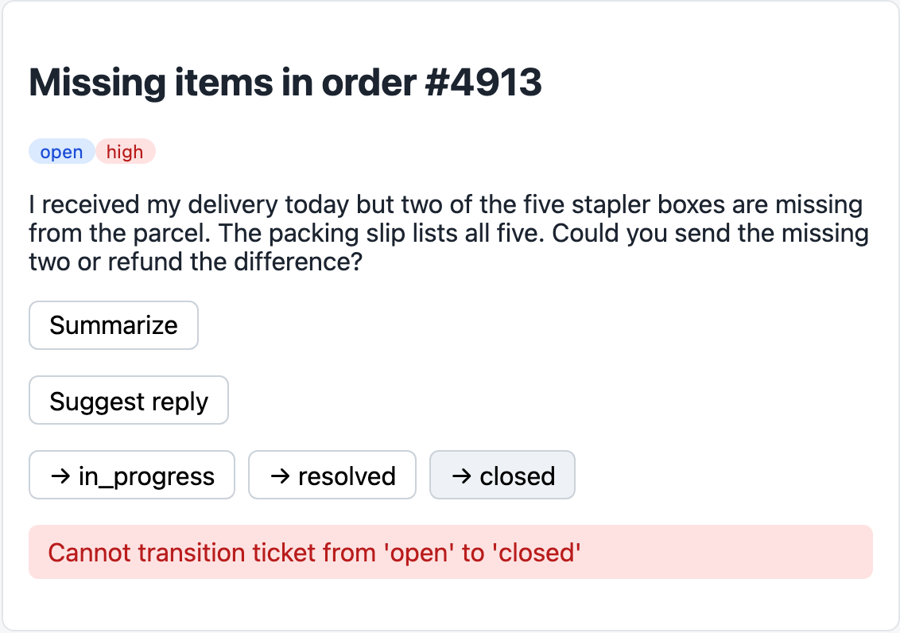
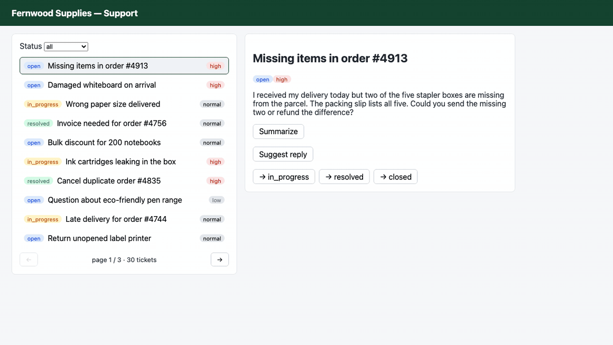
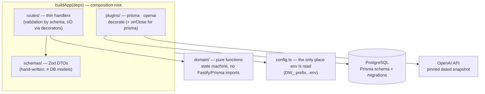

# deskwise-lite

> **A support-ticket helpdesk with an AI copilot** for a fictional office-supplies store,
> *Fernwood Supplies*. An agent works the queue with a status filter and pagination,
> walks each ticket through its status flow, gets a one-click AI summary — and watches
> an AI-drafted reply stream into the page token by token.

<p align="center">
  
</p>

The app is deliberately small — the engineering around it is the showcase: **one Zod
schema per route** drives runtime validation, static handler types, and the OpenAPI spec;
an **Orval-generated react-query client** turns that spec into the frontend's types, so a
backend rename **fails frontend compilation** and a schema change without a regenerated
contract **can't merge** (a CI contract-drift gate, with a live red PR to prove it). The
AI features live in the same typed contract, and reply tokens **stream over SSE**.
Practices familiar from the Python world — schema-first, thin handlers, pure domain
functions, migrations, structured logging — **reproduced on a new runtime**:
Node.js · TypeScript · Fastify · Zod · Prisma · React. *The same engineering standard,
another runtime.*

📸 **Showcase below** · 🚀 **[Run it](#run-it)** · 📚 **Per-iteration docs (Russian) → [docs/iterations/](docs/iterations/)**

---

## The contract pipeline, end to end

| Practice | What is proven | Proof |
|---|---|---|
| **Schema-first API** | One Zod schema = runtime validation (automatic 400s) + typed handlers + OpenAPI | [🖼](#schema-first--one-zod-schema-validation-types-spec) |
| **End-to-end type safety** | Renaming a Zod field makes `tsc` fail in `web/` | [🎞](#end-to-end--rename-a-field-the-frontend-stops-compiling) |
| **CI contract-drift gate** | A schema change without a regenerated contract can't merge | [🖼](#gate--contract-drift-cant-merge) |
| **Full-stack behind nginx** | React UI on generated typed hooks; domain state machine answers 409 | [🖼](#the-app--typed-hooks-all-the-way-to-the-buttons) |
| **Typed AI endpoint** | OpenAI `summarize` is indistinguishable from CRUD in the contract | [⌨](#ai-in-the-contract--summarize-is-just-another-endpoint) |
| **SSE token streaming** | OpenAI tokens stream Fastify → nginx → React as they generate | [🎞](#sse--tokens-stream-to-the-browser-as-they-generate) |
| **Ops surface** | pino JSON logs with request-id; a single error envelope in the spec | [⌨](#ops--structured-logs-and-one-error-envelope) |
| **Fastify plugin architecture** | Plugins are the composition root: `buildApp(deps)`, decorators instead of a DI container | [§](#architecture--seams) |



---

# Proof, practice by practice

## Schema-first — one Zod schema: validation, types, spec

One frame shows the whole idea — the hand-written side is only the Zod schema and the
route registration; everything on the right — `Ticket`, `TicketList`, `useListTickets` —
is generated from `api/openapi.json`:

<p align="center">
  
</p>

The same schema also answers for bad input at runtime — nobody wrote this 400:

```
$ curl -s -X POST localhost:8080/api/tickets -H 'content-type: application/json' -d '{"subject":"x"}'
{"error":{"code":"VALIDATION_ERROR","message":"body/body Invalid input: expected string, received undefined"}}
```

Two design rules keep the pipeline honest: the spec is emitted **only** by a script
(`make openapi` builds the app without listening and serializes the spec — no running
server, no drift between code and file), and **DTOs are not DB models** — the Zod schemas
are written by hand, never generated from Prisma, so the API contract and the storage
schema are free to diverge.

## End-to-end — rename a field, the frontend stops compiling

`web/` never imports TypeScript from `api/` — there is no shared types package, by design.
The only bridge is `openapi.json`, which makes this demo possible: rename
`priority` → `urgency` in the Zod schema, regenerate the contract, and `tsc` in `web/`
refuses to build the UI that still reads `ticket.priority`:



Shared TypeScript types would break the frontend too — but through a side channel, leaving
the published contract free to rot. Deriving the client from `openapi.json` makes the spec
itself the load-bearing bridge, and committing the generated client is what lets CI stand
guard over it.

## Gate — contract drift can't merge

What if you edit the schema and *don't* regenerate? Locally nothing breaks — an additive
optional field breaks nobody: `api` tests stay green, `web` still compiles against the
committed client. The only thing that notices is CI: the `contract-drift` job regenerates
`openapi.json` + the Orval client and requires `git diff --exit-code` to be empty.
[PR #1](https://github.com/DmitryDubovikov/deskwise-lite/pull/1) adds `assignee` to the
`Ticket` schema and deliberately skips `make generate` — kept open as a living demo:



All three jobs (`api`, `web`, `contract-drift`) are required status checks on `main`.
The generated spec and client are committed because they are the gate's input — the diff
against the regenerated truth **is** the assertion.

## The app — typed hooks all the way to the buttons

The UI at the top of this page (Vite + TanStack Query) is built entirely on the generated
hooks — list with filter and offset pagination, detail, status transitions, and the two
AI actions. No DTO type in `web/` is written by hand.

The status state machine (`open → in_progress → resolved → closed`, plus
`resolved → in_progress` reopen) lives in **one pure domain function** — there is no
status PATCH around it, and the UI deliberately does not pre-filter the buttons: an
illegal click just gets the domain's 409 back, in the shared error envelope:

<p align="center">
  
</p>

Behind the scenes it is one `docker compose up` — nginx on `:8080` serves the SPA and
proxies `/api/`:

```
$ docker compose ps
NAME                  IMAGE                STATUS                PORTS
deskwise-lite-api-1   deskwise-lite-api    Up 22 minutes         3000/tcp
deskwise-lite-db-1    postgres:17-alpine   Up 3 days (healthy)   0.0.0.0:5432->5432/tcp
deskwise-lite-web-1   deskwise-lite-web    Up 22 minutes         0.0.0.0:8080->8080/tcp
```

## AI in the contract — summarize is just another endpoint

`POST /tickets/:id/summarize` calls OpenAI (official SDK, pinned dated snapshot,
`temperature=0`), but from the contract's point of view it is indistinguishable from CRUD:
a Zod response schema → the spec → a generated `useSummarizeTicket` hook → the Summarize
button. Live:

```
$ curl -s -X POST localhost:8080/api/tickets/…0001/summarize
{"summary":"Customer received order #4913 with two stapler boxes missing; requests either the missing items or a refund."}
```

The OpenAI client enters the app through the same seam as Prisma — a Fastify plugin
decorating the instance, injected via the `buildApp(deps)` factory — so tests pass a fake
client at the boundary and **CI runs with no network and no key**. Determinism is config:
the model name must match a dated snapshot (`-YYYY-MM-DD`, regex-enforced), prompts are
constants in code.

## SSE — tokens stream to the browser as they generate

`POST /tickets/:id/suggest-reply` is the runtime's home turf: the OpenAI stream is
re-shaped by an async generator into SSE frames and piped out as a Node stream — first
token reaches the client while the model is still writing. `curl -N` shows the wire:

```
$ curl -sN -X POST localhost:8080/api/tickets/…0001/suggest-reply
data: {"delta":"Dear"}

data: {"delta":" Customer"}

data: {"delta":",\n\n"}

data: {"delta":"Thank"}
…
data: [DONE]
```



The last hop matters too: nginx forwards this route with buffering off — otherwise it
would hold the tokens until the response completed, and streaming would die at the proxy:

```nginx
location ~ ^/api/tickets/[^/]+/suggest-reply$ {
    rewrite ^/api(/.*)$ $1 break;
    proxy_pass http://api:3000;
    proxy_buffering off;          # SSE: forward each token frame as it arrives
}
location /api/ { proxy_pass http://api:3000/; }
location /     { try_files $uri /index.html; }
```

This endpoint is a **deliberate exception to the generated contract**: OpenAPI/Orval don't
describe streaming, so the route is hidden from the spec (`hide: true` — Zod validation of
params still applies) and the frontend hook is the one hand-written client in the app.
That gap is itself part of the demo: knowing exactly where the contract approach stops.
An error after the stream starts can't change the HTTP status (200 is long gone), so it
travels as an `event: error` frame carrying the same error envelope.

## Ops — structured logs and one error envelope

Every request logs structured JSON (pino) with a request-id tying the lines together:

```json
{"level":30,"reqId":"req-i","req":{"method":"GET","url":"/tickets/…0001"},"msg":"incoming request"}
{"level":30,"reqId":"req-i","res":{"statusCode":200},"responseTime":2.24,"msg":"request completed"}
```

Every error — validation, 404, domain 409, unhandled 500 — is one envelope, declared as a
Zod schema on each response code in the spec (so the generated client types errors too).
All of them are built by one `errorBody` helper; anything unexpected — validation,
transport, 500 — funnels through a single `setErrorHandler`:

```
{"error":{"code":"CONFLICT","message":"Cannot transition ticket from 'open' to 'closed'"}}
```

Interactive docs render from the same spec at `/docs` (@fastify/swagger-ui).

---

## Architecture & seams

No DI container — the **plugin tree is the composition root**: `buildApp(deps)` builds the
Fastify instance, and dependencies (Prisma client, OpenAI client) enter as arguments,
decorated onto the instance by plugins (`app.prisma`, `app.ai`); the Prisma plugin's
`onClose` hook handles graceful shutdown. Tests call the same factory with fakes —
`vitest` + `fastify.inject()`, no server, no mocking framework.



Layering rules held throughout: handlers are thin (validation by schema, logic in
domain/pure functions, I/O through decorated clients); env is read **only** in
`config.ts` (`DW_` prefix); the domain state machine imports nothing from Fastify or
Prisma. `web/` and `api/` are two independent packages with their own lockfiles — no
workspaces, because the only sanctioned bridge is `openapi.json`.

## The Python analog map

The runtime is new here on purpose — and the fastest way to hold new equipment to an
existing engineering standard is to map every concept to a known analog. Each choice in
this codebase has one: Fastify ≈ FastAPI (schema on the route → validation + types +
spec), Zod ≈ Pydantic, Prisma ≈ SQLAlchemy + Alembic, `vitest` + `inject()` ≈
pytest + TestClient, pino ≈ structlog. AI stays a feature of the fixture, not the axis:
no LangChain, no evals, no prompt registries — two generative helpers behind the same
seams as everything else.

## Run it

Requires `pnpm` (built on pnpm 11, Node 22) and Docker. Fastest path — the whole stack in
containers. Before `make up`, create `api/.env` (`cd api && cp .env.example .env`): compose
hands it to the api container. Everything except the two AI buttons works without a real
`DW_OPENAI_API_KEY`; with one, the AI calls cost fractions of a cent.

```bash
make up       # docker compose up --build: nginx :8080 (SPA + /api/ proxy) + api + Postgres
make seed     # idempotent seed of ~30 Fernwood Supplies tickets (fixed ids + upsert)
# open http://localhost:8080 — list, detail, status transitions, Summarize, Suggest reply

curl -sN -X POST localhost:8080/api/tickets/<id>/suggest-reply   # watch the tokens arrive
```

For development — dependencies, env, and targets from the root `Makefile`:

```bash
cd api && pnpm install && cp .env.example .env && cd ..
cd web && pnpm install && cd ..

make db-up    # Postgres 17 from docker-compose.yml (healthcheck, named volume)
make migrate  # prisma migrate dev — applies api/prisma/migrations/
make dev      # tsx watch → Fastify on :3000 (curl localhost:3000/health)
make web-dev  # Vite dev server :5173 with /api proxy → :3000
make test     # vitest: inject() tests against real Postgres; OpenAI faked, no network
make check    # Biome (lint+format) + tsc --noEmit (strict, api and web) + vitest
make openapi  # emit api/openapi.json from the Zod route schemas
make generate # the whole contract pipeline: openapi.json → Orval → web/src/generated/
```

Honest footnotes: all endpoints are public — auth/JWT was consciously cut as not paying
its way for this project's goal; the AI features are generative on purpose
(summarize / suggest-reply, not classification). Total OpenAI spend for the whole project,
demos included: **well under $1**.

## What this puts on a résumé

- *Built a full-stack TypeScript app (Fastify + React/Vite behind nginx, Docker Compose):
  a schema-first API where Zod route schemas drive runtime validation, static handler
  types, and generated OpenAPI — consumed by an Orval-generated typed react-query client
  for end-to-end type safety, enforced by a CI contract-drift gate.*
- *Integrated OpenAI into the service: a typed JSON endpoint through the same generated
  contract, plus an SSE endpoint streaming completion tokens from Fastify to React.*

`Node.js · TypeScript · Fastify · Zod · Prisma · PostgreSQL · React · Vite ·
TanStack Query · Orval (OpenAPI codegen) · SSE · OpenAI API · nginx · Docker Compose ·
Vitest · Biome · GitHub Actions` — *the same engineering standard, another runtime.*
